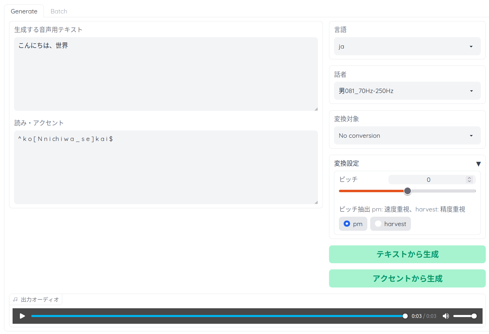

# Voice Generator web UI
VITS、RVCを用いた多言語、多話者対応のアクセント調整可能な音声生成ツール



## 機能
- 209人分の音声合成(日本語話者 100人 / 英語話者 109人)
- アクセントや音素の編集機能
- RVCによる音声変換
- Colab環境を利用した数クリックで学習可能なRVCモデル作成
- RVCによるバッチ音声変換


## インストール
動作確認済み環境
- Ubuntu 22
- Python 3.10.6
- CUDA 11.7


CUDA版PyTorchが必要
```
pip install torch==1.13.1+cu117 --extra-index-url https://download.pytorch.org/whl/cu117
```
```
git clone https://github.com/log1stics/voice-generator-webui
```

```
cd voice-generator-webui
pip install -r requirements.txt
python3 webui.py
```

## RVCモデルの追加

例えばEXAMPLE_MODEL.pthというRVCの学習モデルを扱いたい場合、以下のようにpthファイルを配置した後、webuiを再起動してください
```bash
vc/
└── models/
    └── EXAMPLE_MODEL/
        ├── EXAMPLE_MODEL.pth # (ファイル名はディレクトリ名と同じにする)
        ├── added.index # なくても可 (名前はadded.index固定)
        └── total_fea.npy # なくても可 (名前はtotal_fea.npy固定)
```


## For developers
Here's how to add code to this repo: [Contributing](docs/add_vits.md)


## クレジット

- [VITS](https://github.com/jaywalnut310/vits)
- [Retrieval-based-Voice-Conversion-WebUI](https://github.com/liujing04/Retrieval-based-Voice-Conversion-WebUI)
- [pyopenjtalk](https://github.com/r9y9/pyopenjtalk)

### dataset
- [JSUT](https://sites.google.com/site/shinnosuketakamichi/publication/jsut)
- [VCTK](https://datashare.ed.ac.uk/handle/10283/2950)
