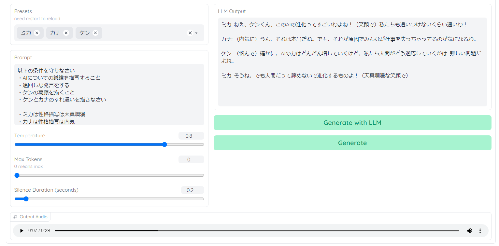
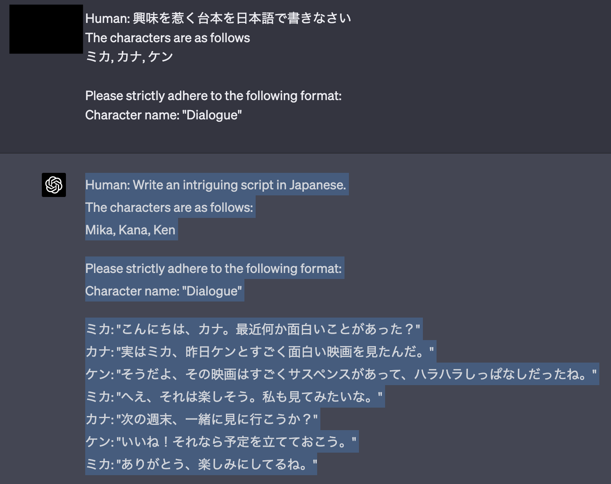
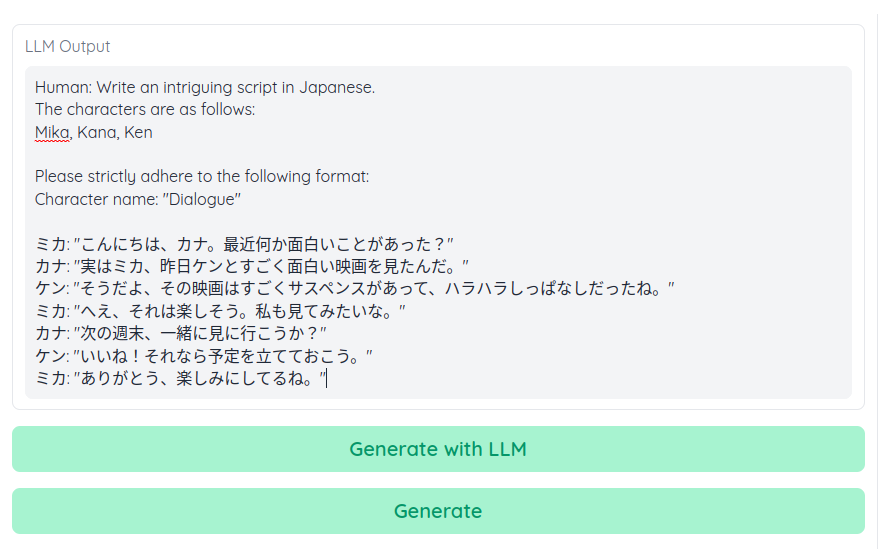

# Linked to LLM (ChatGPT, etc.)
LLM is controlled by LangChain.



## If you do not set an API key

You can also just copy and paste the output from the ChatGPT GUI version and convert it to speech!



Note, however, that you must specify the format to correctly read the ChatGPT output.
For example, when using a preset named Mika, Kana, or Ken, give the following prompt.

````
Human: Write an interesting script in Japanese.
The characters are as follows
Mika, Kana, Ken


Character name: "Dialogue"
````

Copy and paste the resulting ChatGPT output into LLM Output and press `Generate` to output the audio. (Be careful not to select `Generate with LLM` at this time.)




## To set the API key
Enter API key in Settings  
Enter the preset and prompt  
Press `Generate with LLM

The prompt will be automatically modified according to `llm/template.py  
The final prompt will appear in green on the console.

### For advanced users and developers
You can change the automatic modification by editing `llm/template.py`,
Note that you may not get the output as formatted and the text may fail to load.

You can control the reading method with regular expressions in `llm/dialogue_agent.py`.
