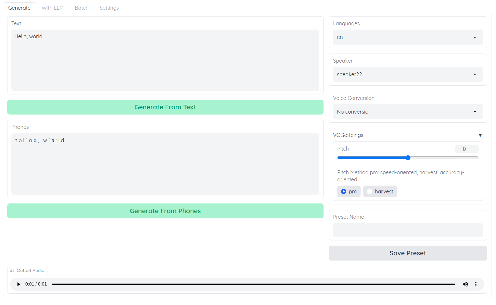

# Voice Generator web UI
VITS、RVCを用いた多言語、多話者対応のアクセント調整可能な音声生成ツール
<div align="center">

[](https://colab.research.google.com/github/log1stics/voice-generator-webui/blob/main/colab.ipynb)

</div>



## 機能
- 209人分の音声合成(日本語話者 100人 / 英語話者 109人)
- [LLMを用いた台本生成](how_llm.md)
- [アクセントや音素の編集](accent.md)
- RVCによる音声変換
- RVCによるバッチ音声変換


## インストール

### 前提
- [Python](https://www.python.org/downloads/windows/) (3.10.6でテスト済み)

- CUDA版PyTorch  
 `pip show torch` でCUDA版PyTorchがインストール済みか確認  
以下のように`cu`という文字がVersionに含まれてればOK
```shell
Version: 2.0.0+cu118
```
含まれてない場合はCUDA版PyTorchをインストール
```shell
pip uninstall torch
pip install torch --index-url https://download.pytorch.org/whl/cu118
```


### Windows

1. zipをダウンロードするか
`git clone https://github.com/log1stics/voice-generator-webui`

3. `setup.bat`を実行  
pyopenjtalkのインストールでエラーになる場合[こちら](dependencies.md)を確認してください

PowerShellやコマンド プロンプトでwebui.pyファイルを実行
```shell
python webui.py
```

[espeakのインストール](dependencies.md#espeak-英語を生成しない場合は不要) (英語を生成しない場合はインストール不要)

### Linux


```shell
git clone https://github.com/log1stics/voice-generator-webui
chmod +x setup.sh
```
```shell
setup.sh
```

```shell
# If you do not use Japanese Text To Speak
# avoid install pyopenjtalk
setup.sh en
```
```shell
# For English Text To Speak
apt-get install espeak
```

## RVCモデルの追加

例えばEXAMPLE_MODEL.pthというRVCの学習モデルを扱いたい場合、以下のようにpthファイルを配置した後、webuiを再起動してください
```bash
vc/
└── models/
    └── EXAMPLE_MODEL/
        ├── EXAMPLE_MODEL.pth # (ファイル名はディレクトリ名と同じにする)
        ├── added.index # なくても可 (名前はadded.index固定)
        └── total_fea.npy # なくても可 (名前はtotal_fea.npy固定)
```


## For developers
Here's how to add code to this repo: [Contributing](docs/add_vits.md)


## Credits

- [VITS](https://github.com/jaywalnut310/vits)
- [Retrieval-based-Voice-Conversion-WebUI](https://github.com/liujing04/Retrieval-based-Voice-Conversion-WebUI)
- [pyopenjtalk](https://github.com/r9y9/pyopenjtalk)

### Dataset
- [JVS](https://sites.google.com/site/shinnosuketakamichi/research-topics/jvs_corpus)
- [VCTK](https://datashare.ed.ac.uk/handle/10283/2950)
