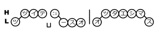

# 日本語の音素・アクセントに関して

引用、参考にさせていただいた実装・論文はページ末尾に記載しております。  
VG webuiではアクセントをピッチ(音程)の上昇・下降で表現しています。

- `[`  
ピッチの上昇

- `]`  
ピッチの下降

- `#`  
アクセントの境界

### 例

`続いて、ニュースをお伝えします`

`^ ts u [ z u i t e _ ny u ] u s u o # o [ ts u t a e # sh i [ m a ] s u $`

## 音素
ローマ字と同じ原理で母音`a i u e o`と子音を組み合わせます。
子音がどれに当たるかは実際に出力してみるか、[jvs_symbols ](https://github.com/log1stics/voice-generator-webui/blob/main/tts/text/symbols.py#L18)を参考にしてみてください

## その他の記号

- `_`  
休符、句読点

- `cl`  
促音、「っ」で表される音

- `^`  
テキストの開始合図
- `$`  
テキストの終了合図
- `?`  
テキストの終了合図 (疑問形)

# 英語に関して
英語に関しては元々学習データが充実していて、高品質な生成ができているので、生成後に音素等を編集することは基本的に想定していません。  
もし音素の構成や出力過程を理解したい場合は以下をご参照ください。

- https://github.com/espeak-ng/espeak-ng/blob/master/docs/dictionary.md

- https://bootphon.github.io/phonemizer/python_examples.html

---
## 参考
実装
- https://github.com/espnet/espnet  

論文
- https://www.jstage.jst.go.jp/article/transinf/E104.D/2/E104.D_2020EDP7104/_article