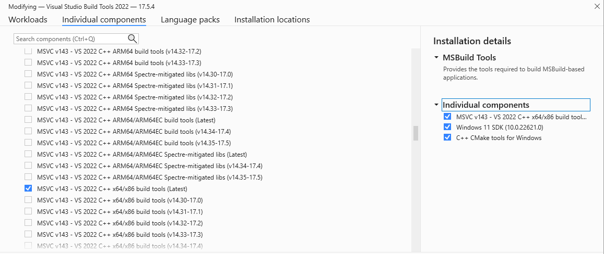
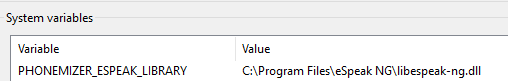

## Build Tools for Visual Studio
日本語の音素、アクセント解析にpyopenjtalkを用いています。  
pyopenjtalkのWindowsへのインストールにはマイクロソフトから提供される3つのツールが必要です。

### インストール
[こちら](https://visualstudio.microsoft.com/ja/downloads/#build-tools-for-visual-studio-2022)から`Build Tools for Visual Studio 2022`をダウンロード & 実行し以下のツールをインストールしてください。

`C++ Cmake tools for Windows`  
`MSVC v143 -VS 2022 C++ x64/x86 build tools (Latest)`  
`Windows 11 SDK`

インストール後、システム環境変数を設定して完了となります。

[システム] > [バージョン情報] > [システムの詳細設定] > [環境設定] > [環境変数]
システム環境変数の`Path`を編集して以下を追加

`C:\Program Files (x86)\Microsoft Visual Studio\2022\BuildTools\Common7\IDE\CommonExtensions\Microsoft\CMake\CMake\bin`

PowersShellやVSCodeを再起動しないと環境変数はPowersShellやVSCodeに反映されませんので注意してください。

## espeak (英語を生成しない場合は不要)

英語の音素解析には[phonemizer](https://github.com/bootphon/phonemizer)を用いており、phonemizer内部でespeakを用いています。  
これは[VITS本家](https://github.com/jaywalnut310/vits)の解析方法をそのまま踏襲しています。

espeakがない場合英語の音声生成時に以下のエラーが発生するはずです。  
`RuntimeError: espeak not installed on your system`

### espeakのインストール
[こちら](https://github.com/espeak-ng/espeak-ng/releases)から `espeak-ng-X64.msi`をダウンロードし実行してください。  
実行後、以下をシステム環境変数に`PHONEMIZER_ESPEAK_LIBRARY`を追加して値を以下に設定して完了です。  
`C:\Program Files\eSpeak NG\libespeak-ng.dll`

PowersShellやVSCodeを再起動しないと環境変数はPowersShellやVSCodeに反映されませんので注意してください。

---
参考
- pyopenjtalk  
https://github.com/log1stics/voice-generator-webui/issues/1  
https://discourse.slicer.org/t/configuring-slicer-fails-c-compiler-not-found/23340/3

- espeak  
https://bootphon.github.io/phonemizer/install.html#on-windows  
https://github.com/bootphon/phonemizer/issues/44