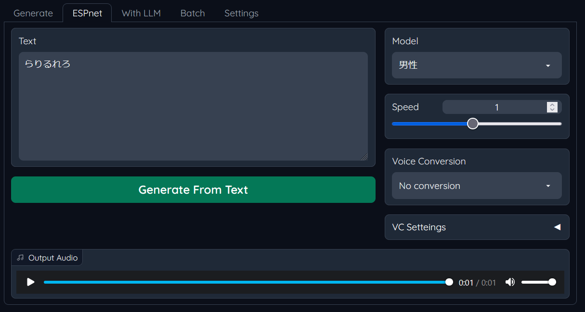

# ESPnet
https://github.com/espnet/espnet

事前に`pip install espnet`を実行してESPnetのインストールが必要

TTS部分にESPnetを使用し、発音全般が精度向上(特にら行など)  
現状このモードでのアクセント編集は不可

- 男性モデル
https://zenodo.org/record/5432540
- 女性モデル
https://zenodo.org/record/5432566