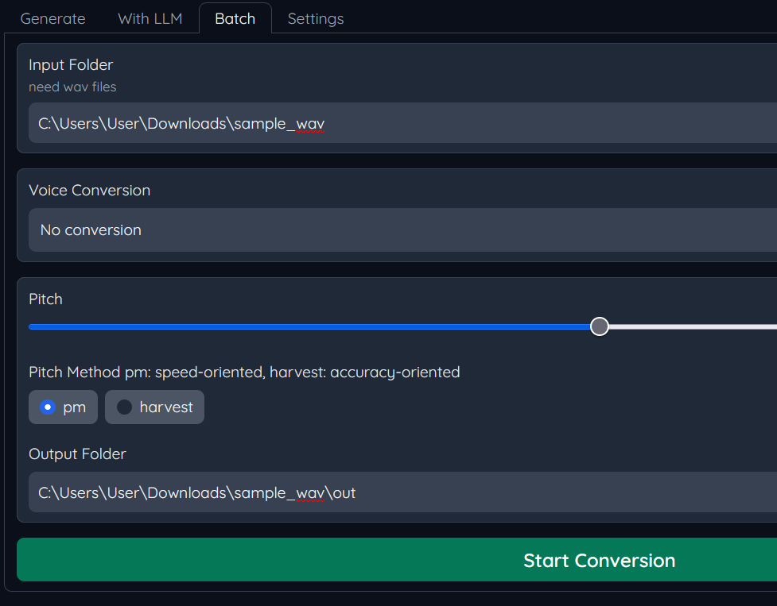
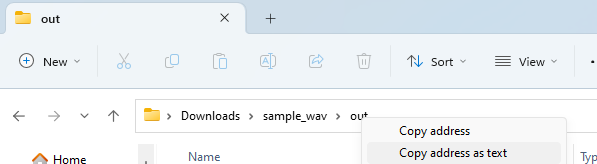

# バッチ変換
フォルダ内のwavファイルを一括でRVC変換します。

Input Folder内のwavファイルをすべてOutput Folderへ変換し保存します。  
Input FolderとOutput Folderの指定方法の一例は以下です。

フォルダのパスはエクスプローラーのバーを右クリックすることでテキストとしてコピーすることができるのでInput FolderやOutput Folderに貼り付けて指定してください。  
(Input FolderとOutput Folderを同じにすると元のwavファイルは上書きされてしまうので注意してください)

